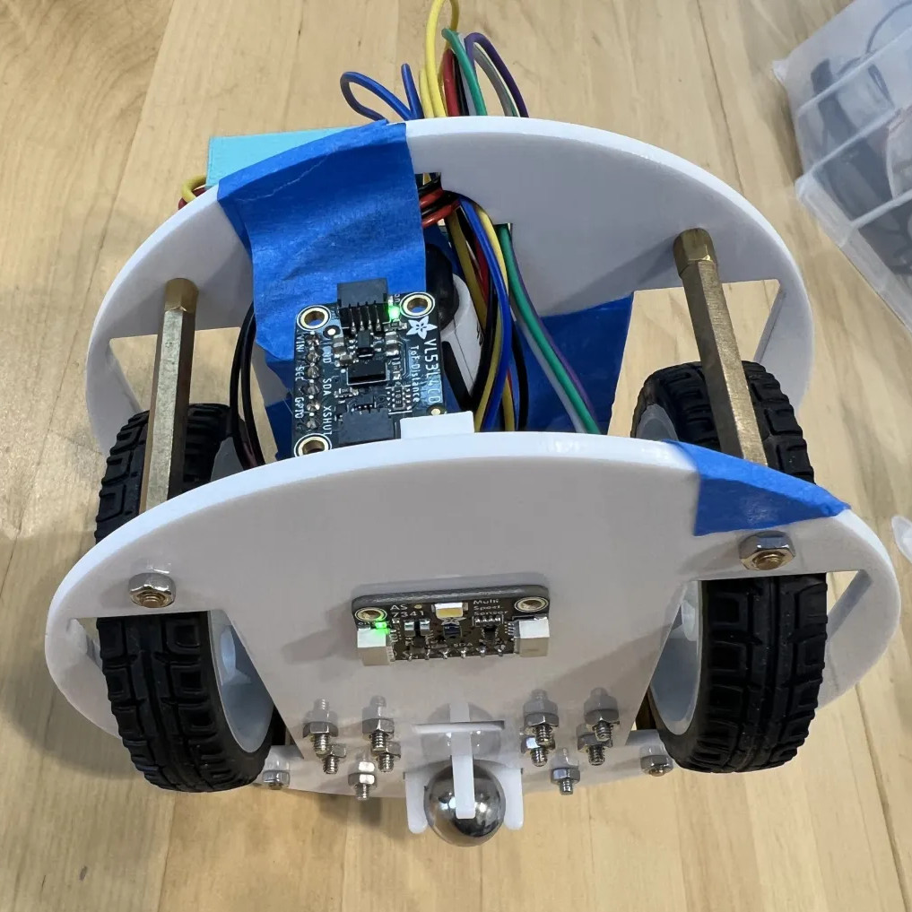
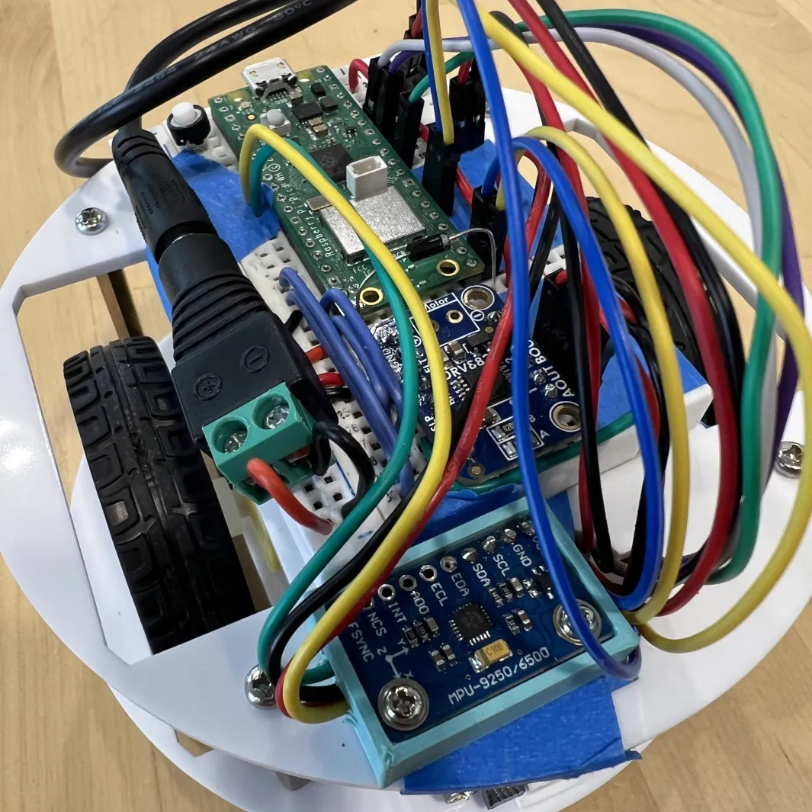
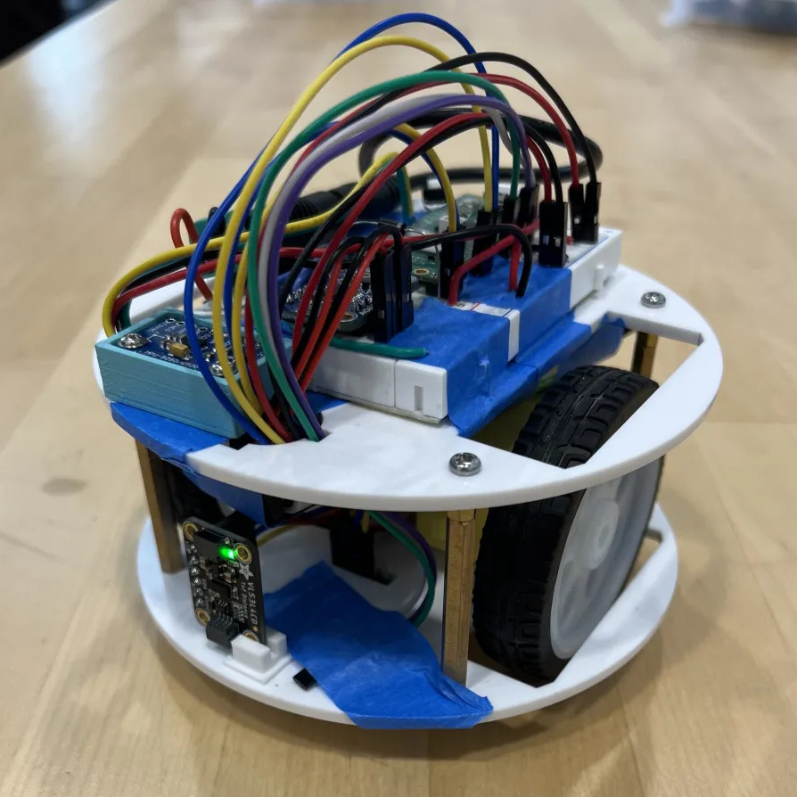

<h1 align="center">SAR Robot for AHS Electronics Workshop 2024</h1>

<div align="center">
    <b>
        <a href="#video">Video</a>
        ·
        <a href="#components">Components</a>
        ·
        <a href="#file-information">File Info</a>
        ·
        <a href="#code-highlights">Code Highlights</a>
        ·
        <a href="#thanks">Thanks</a>
    </b>
</div>
<br />

<p align="center">
    
    
    
    
</p>

I helped organize the "Search And Rescue" project in the second semester of AHS's new Electronics Workshop class, consisting of tons of fun research, building, debugging, and programming over a super short time period. It was easily the most fun I had in all of highschool :)

> [!NOTE]
> Check out the [SAR Documentation](https://docs.google.com/document/d/18LBs0AmaSnT2yeP5mM6TQh5jgIuw7PlEmnaEUqvHnw0/edit?usp=sharing) I wrote with tons of information on the course, components, and more!

## Video

<div align="center">
    <!-- GitHub markdown is cursed: I had to drag and drop the video from ./assets to get it to render -->
    <video src='https://github.com/user-attachments/assets/87c03c82-08e6-4be1-afaa-fc3ae3a5adf8'/>
</div>
<p align="center"><em>it might not look like much; there's a lot more going than you'd think!</em></p>

> [!IMPORTANT]
> _This project was very rushed._ We came in with no experience or practice, and had only 1/3 a semester to make everything happen. The cardboard "arena" shown above was thrown together in the last second; there are **so** many improvements, changes, and new ideas I'd love to try. If I had time I would...
> 
> - Redesign the chassis to make battery easily removable
> - Wire everything better and with less tape
> - Fasten the breadboard and sensors much better
> - Make more use of the IMU
>     - Implement a proper PID for the gyroscope-based swerve correction
>     - Try out Sensor Fusion (eg. Madgwick's) for proper orientation!!
>     - Incorporate gyroscope in 90degree turns (not just distance sensor)
> - Properly detect hidden magnet and colored squares via hall effect and color sensors
> - Hardcode less magic values; clean code significantly
> - Improve MicroPython ports of Adafruit libraries (which were quite rushed)
>
> etc... But alas the year was over before we knew it. With that said, a lot was still accomplished; have a look below!

## Components

- Microcontroller (RPI Pico W)
    - On the center of the breadboard. Controls everything below
- IMU (Inertial Measurement Unit) (MPU9250):
    - On the top plate in front of the breadboard, in the blue box
    - Used for:
        - dynamic swerve correction
        - orienting to magnetic north
        - turning n degrees (only used in testing)
    - Wanted to try sensor fusion, but ran out of time!
- Motor controller (DRV8833):
    - On the breadboard next to the pico
    - Drives the two main motors (DC Gearbox "TT Motor")
- Distance sensor (VL53L4CD):
    - Front of bot, sitting on bottom place, pointing forward
    - Used to snake through the arena: turning 90 degrees and stopping at walls
- Color sensor (AS7341):
    - Underneath bottom plate, facing down
    - Tested and working, but not used in code (ran out of time)
- Hall Effect sensor (DRV5053CAQLPGM):
    - Taped to the bottom plate in the front
    - Used to detect the hidden magnet under the arena 

## File Information

- **main.py:** The first script that's run on startup. Initializes WiFi, calls
sar_main.py, handles reruns
- **sar_main.py:** The actual programs that make the bot do things

All other files in the repository are libraries required to use various sensors and components, copy pasted from their respective repos.

## Code Highlights

Here are some of the important functions, with comments copied directly from the code. See the sar_main.py for the implementations!
(note: these function signatures aren't very clean; as with most things it was all rushed :P)

#### [wait_until_dist_slope_change](https://github.com/Bvngee/SAR/blob/main/sar_main.py#L109-L138)
```python
# WORKING, BUT CURRENTLY UNUSED
# This waits until the slope of the distance sensor graph changes signs. That
# is, it waits until the distance readings go from getting closer to getting
# farther or vice versa. Bot should already be spinning
# Parameters:
# - curr_slope_positive: whether to wait for (+)=>(-) or (-)=>(+) slope change
# - last_dists_size: Compare the average of the last n readings to determine a slope change
# - streak_needed: how many times in a row the last readings needs to be >or< than the
#           previous readings to be considered a slope change
def wait_until_dist_slope_change(
    curr_slope_positive: bool,
    streak_needed: int = 5,
    last_dists_size: int = 5,
): ...
```

#### [wait_until_dist_slope_near_zero](https://github.com/Bvngee/SAR/blob/main/sar_main.py#L150-L175)
```python
# This waits until the slope of the distance sensor graph approaches zero. It
# has the same effect as wait_until_dist_slope_change(), but instead of waiting
# until after a slope change, it waits until just before the slope chnage. Bot
# should already be spinning
# Parameters:
# - curr_slope_positive: whether to wait for (+)=>(-) or (-)=>(+) slope change
# - max_stopping_diff: the slope delta thats considered close enough to zero
# - list_size: keep track of this many readings, average them to determine if
#           slope is close enough to zero
def wait_until_dist_slope_near_zero(
    curr_slope_positive: bool,
    max_stopping_diff: float = 1,
    list_size: int = 5,
): ...
```

#### [turn_n_degrees_gyro](https://github.com/Bvngee/SAR/blob/main/sar_main.py#L186-L207)
```python
# WORKING, BUT CURRENTLY UNUSED
# This uses the IMU's gyroscope to turn approximately n degrees in one
# direction. It does this by integrating the gyro's Z-axis over time, which is
# angular velocity, to get the current angle turned and stops when close to n
# deg. It also scales the speed of the motors quadratically, slowing them down
# as it approaches the full n degree turn as an attempt to increase precision.
# It's surprisingly close to perfect, however I did not end up using it because
# the error builds up super fast over when used multiple times in a row.
def turn_n_degrees_gyro(degrees: float): ...
```

#### [mag_to_deg](https://github.com/Bvngee/SAR/blob/main/sar_main.py#L224-L229)
```python
# Takes in a tuple of magnetometer readings on the x/y/z axis and spits out
# heading aka yaw (degrees rotated around the verticle axis). Output is from
# -180 to 180 degrees where 0deg is geomagnetic north
def mag_to_deg(mag: tuple) -> float: ...
```

#### [drive_corrected_until_distance](https://github.com/Bvngee/SAR/blob/main/sar_main.py#L298-L369)
```python
# This drives the bot forward until it's `dist` cm's away the wall. While doing
# so, it uses the Z-axis of the gyroscope (angular velocity) to dynically
# correct for swerving and motor inconsistencies. This is, if it's detected
# that the bot is swerving right, it increases the throttle to the right
# motor to account for it. If it's instead detected that the bot is swerving
# left, it increase throttle to the left motor. This could be thought of as a
# rudamentary PID alrogithm; in fact, I tried incorporating Integral
# calculations as well (to determine the correction factor) but never had time
# to make it work well.
# Additionally, if the hall effect sensor value is within a certain magnetic
# field strength, it turns the LED on.
def drive_corrected_until_distance(dist: float, current_row: int): ...
```

#### [turn_90_degrees_dist](https://github.com/Bvngee/SAR/blob/main/sar_main.py#L377-L404)
```python
# Turns the bot 90 degrees by waiting for the slope of the distance sensor
# graph to approach zero two separate times. This takes advantage of the
# box arena having flat walls and the observation we made that while
# turning in a circle the distance sensor readings graph has two clear,
# easily measurable peaks.
def turn_90_degrees_dist(spin_direction: int): ...
```

#### [main](https://github.com/Bvngee/SAR/blob/main/sar_main.py#L411-L449)
```python
# Main loop.
# Spins towards magnetic north (which the arena is aligned to), then drives in
# a snake pattern over all squares in the arena while searching for the magnet
# hidden underneath.
def main(): ...
```

## Thanks

A huge thanks to Mr. Castle and Mr. Morris for being totally awesome and for making the project and class possible. And to @blobbybilb, who made it the most fun part of my day!
