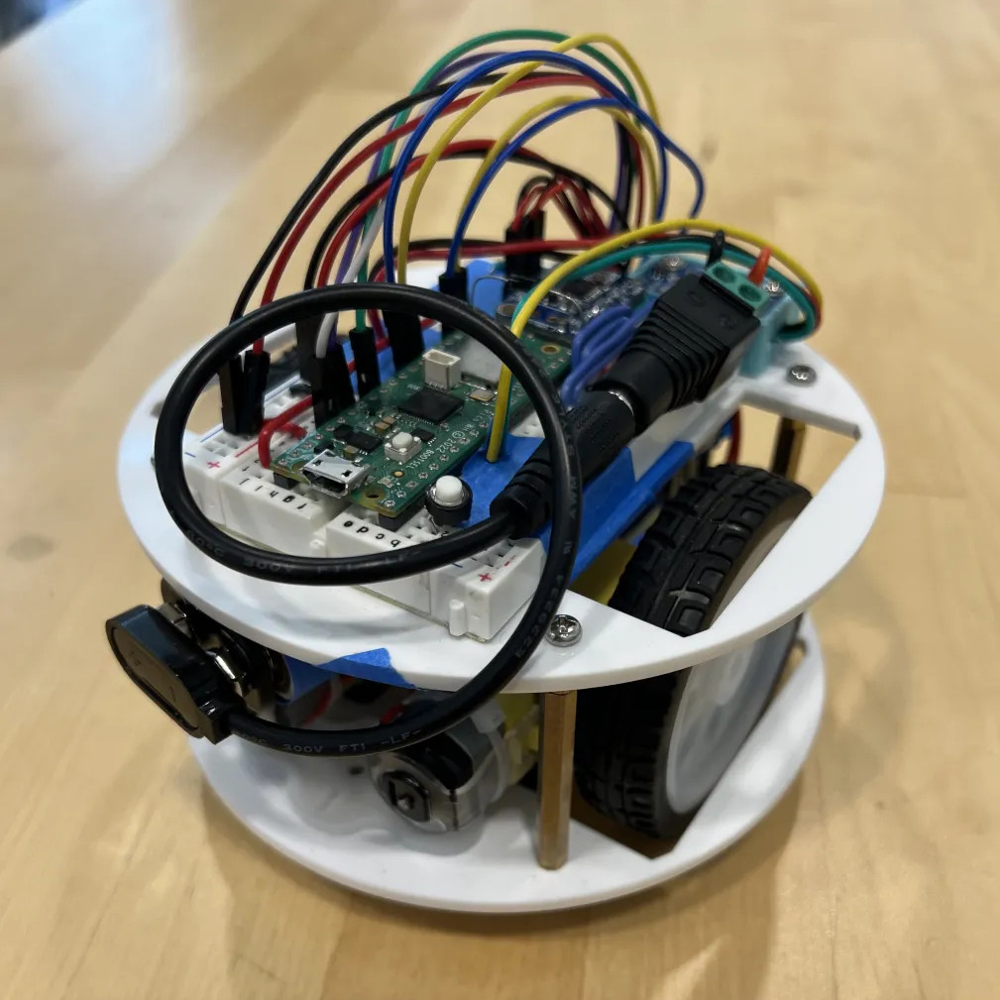

<h1 align="center">SAR Robot for AHS Electronics Workshop 2024</h1>

    <a href="https://docs.google.com/document/d/18LBs0AmaSnT2yeP5mM6TQh5jgIuw7PlEmnaEUqvHnw0/edit?usp=sharing">SAR Project Documentation</a>

    
    
    
    

I helped organize the "Search And Rescue" project during the
second semester of AHS's new Electronics Workshop class, consisting of
lots of research, design, and programming over an extremely short time period. This
project was easily the most fun I had throughout all of highschool :) The code in
this repository is everything I used to program my robot to do stuff like this
(there's more going here on than it looks like!):

    <video alt="sar_video" width="80%">
        <source src="./assets/sar_video_small_noaudio.mp4" type="video/mp4">
    </video>

I recently went through and updated the code to be as self-documenting as
possible. Have a look!

## Files

**main.py:** The first script that's run on startup. Initializes WiFi, calls
sar_main.py, handles reruns.
**sar_main.py:** The actual programs that make the bot do things.

## Code Overview
